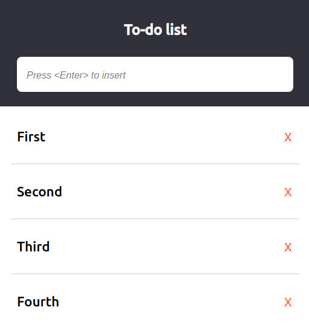

# Todo list - Vanilla JS
Todo list made with Vanilla JavaScript

## Preview - [GitHub Pages](https://paulohbsimoes.github.io/vanilla_todo_list/)

## References
[Framework Free - Functional HTML Rendering and State Management in Vanilla JS - Drew Warren](https://www.youtube.com/watch?v=yBg8w_5THS4)
